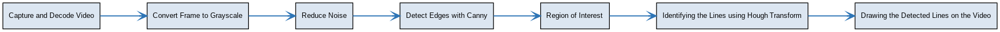

# Real-Time Road Lane Detection

Developed a real time lane detection system that finds the border of the lane by analyzing the video feed.

## Tech Stack

**Libraries:** OpenCV,Numpy

**Language:** Python

## Working

1. **Capture and Decode Video:** Load the video using the VideoFileClip object. Each frame of the video is extracted and converted into a sequence of images for further processing.
2. **Convert Frame to Grayscale:** The extracted video frames are initially in RGB format. To make processing faster, we convert them to grayscale. 
3. **Reduce Noise:** Before performing edge detection, We reduce the noise by using Gaussian Blur. This helps in image quality by eliminating high frequency noise. 
4. **Detecting Edges with Canny Edge Detector:** The Canny Edge Detector is applied to the blurred image to detect regions with significant intensity changes, which are liekly to be edges.
5. **Defining the Region of Interest(ROI):** To focus only on the road lane, a mask is created that matches the image dimensions. This mask highlights the region of interest, such as the area where lane lines are expected. We then use a bitwise AND operation between the edge-detected image and the mask to retain only the relevant area.
6. **Identifying the lines using Hough Line Transform:** The Hough Line Transform is used to detect straight lines in the region of interest. The Probabilistic Hough Line Transform is employed here for better efficiency, analyzing only a subset of points to detect lines accurately.
7. **Drawing the Detected Lines on the Video:** The detected lines are drawn on the video which is saved in the output.mp4. 

## Demo
<table>
  <tr>
    <!-- Left Column -->
    <td align="center">
      
      
<b>Original Road Video</b>

    </td>
    <!-- Right Column -->
    <td align="center">
      
      
<b>Road Video with Detected Lines</b>

    </td>
  </tr>
</table>

